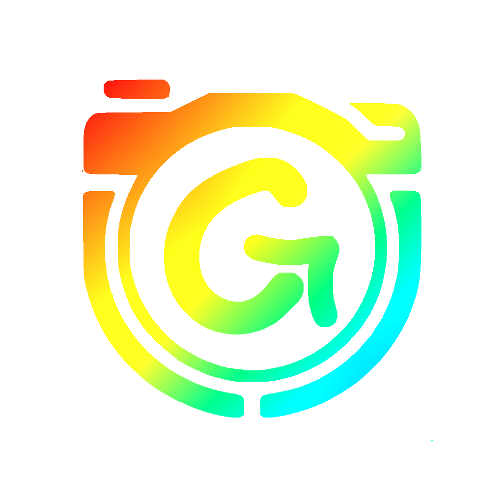

# Welcome to GyroCam 🔄📸
*Spoilers: I let DeepSeek AI write the markdown cause its so much faster, I just gave him my code and said to write it*

  

**The Smart Orientation-Conscious Camera App**  
*Never suffer from sideways videos again!*

---

## About GyroCam 🧭

GyroCam revolutionizes mobile videography by automatically handling device orientation changes. Our unique **Auto-Orientation System** stops and restarts recording every time you rotate your device, ensuring perfect portrait/landscape alignment in every clip.

Key Innovation:  
✅ **Orientation Lock** - Maintains natural perspective during complex movements  
✅ **Seamless Restart** - Instant recording continuation after rotation  
✅ **Clip Stitching** (Beta) - Automatically combines related clips during export

---

## Features 🚀

### 📐 Orientation Intelligence
- Real-time gyroscopic monitoring
- Orientation badge overlay
- Landscape lock override
- Face up/down detection

### 🎥 Professional Capture
- **Resolutions**: 4K UHD | 1080p | 720p  
- **Frame Rates**: 240fps | 120fps | 60fps | 30fps  
- HDR10+ Support  
- Multi-lens switching (Wide/Ultra Wide/Tele)  
- Pro Mode: Manual ISO & Shutter Speed

### ⚙️ Customization
- Dynamic theme colors  
- Customizable UI elements:
  - Zoom/Focus bars  
  - Quick Settings panel  
  - Preview maximization  
- Smart aspect ratio preservation

### 📱 Device Optimization
- iPhone & iPad support  
- iOS 18 ready  
- Background processing  
- Low-light enhancements

---

## Installation 📲

### Sideloading Instructions:
1. Download latest IPA from [Releases tab](https://github.com/yourusername/GyroCam/releases)
2. Install [Sideloadly](https://sideloadly.io/)
3. Connect iOS device & trust computer
4. Drag IPA into Sideloadly
5. Enter Apple ID (app-specific password recommended)
6. Click Start!

*Note: Requires free developer account (7-day signing) or paid account for year-long install*

---

## Changelog 📜

- [View Full Changelog](CHANGELOG.md)

---

## Contributing 🤝

We welcome issues and PRs! Please review our:
- [Contribution Guidelines](CONTRIBUTING.md)
- [Roadmap](ROADMAP.md)
- [Privacy Policy](PRIVACY.md)

---

  *Made with ❤️ by Fayaz Shaikh - Because Vertical Video Shouldn't Mean Vertical Problems*

